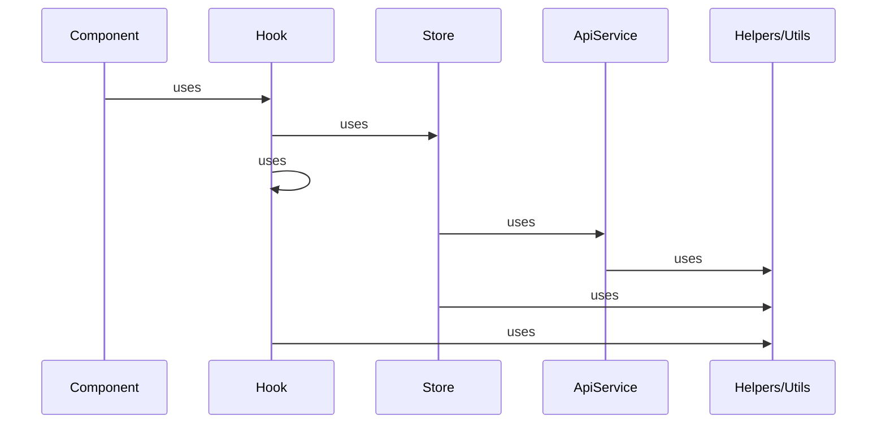

<h1>:policeman: Standard, Rules and Flows </h1>

#### :policeman: ST1: Clear Code Structure



#### :policeman: ST2: Luôn để slash ở đằng sau BaseURL

NEXT_PUBLIC_MAIN_ENDPOINT=https://5bf0b7fb0756d20013119887.mockapi.io/api/dealers/search/

- Quy ước URL KHONG có slash ở đằng sau thường thể hiện đây là 1 resource duy nhất
- Quy ước URL có slash ở đằng sau thể hiện 1 directory hoặc 1 resouce collection
  > Đây là lí do tại sao baseURL cần có slash ở đằng sau.
- ví dụ:
  - "http://example.com/mydirectory/example.html" là 1 resource duy nhất
  - "http://example.com/products/" là một resource collection ( vì theo sau có thể là id, hoặc path khác). chẳng hạn "http://example.com/products/100" hoặc "http://example.com/products/blabla"

#### :policeman: ST3: nguyên lý cái ly

- 1 cái ly là 1 cái ly, không thể lấy 1 cái ly mang đi múc nước rồi nói là cái gáo
-

```js
// don't
const useMenu = () => {
  const { category: submenu, getCatagories } = useCategory(); // should not rename from `category` to `submenu`
	const menus = [
		{
			name: 'menuA'
			submenu: submenu
		},
	]
  return {
	menus,
    getSubMenu: getCatagories, // should not rename
  };
};
```

```js
// do
const useMenu = () => {
  const { category } = useCategory();
  	const menus = [
		{
			name: 'menuA'
			submenu: category.map(transformCategory)
		},
	]
  return {
    menus
  };
};
```

#### :policeman: ST4: 1 hook chứa 1 nghiệp vụ duy nhất (SRP)

```js
const useMenu = () => {
  return {
    menus,
    fetchUserList, // ???? this is not allowed
  };
};
```

#### :policeman: ST5: store phải có ít nhất 1 property

```ts
// don't
export const CustomerStore = atom<Array<CustomerState>>({
  key: "CustomerStore",
  default: [], // don't do this
});
```

```ts
// do
export const CustomerStore = atom<Array<CustomerState>>({
	key: "CustomerStore",
	default: {
		customers: [], // at least 1 property
	},
};
```

#### :policeman: ST6: nếu store có nhiều hơn 1 property, mỗi property store phải được sử dụng bởi 1 hook [draft]

```ts
export const CustomerStore = atom<Array<CustomerState>>({
	key: "CustomerStore",
	default: {
		customers: [],
		selectedCustomer: {}
	},
};
```

#### :policeman: ST7: hạn chế call API useEffect trong custom hook

```js
// don't
export function useCustomers() {
  const customers = useCustomerStoreValue();
  const { getCustomers } = useCustomerStoreActions();

  useEffect(() => {
    getCustomers();
  }, []);

  return { customers };
}
```

```js
// do
export function useCustomers() {
  const customers = useCustomerStoreValue();
  const { getCustomers } = useCustomerStoreActions();

  return { customers, getCustomers };
}

const Component = () => {
  const { getCustomers } = useCustomers();

  useEffect(() => {
    getCustomers();
  }, []);

  return;
};
```

- Trong custom hook, 1 useEffect dùng để access DOM thì ok

```js
// ok
export function useCustomers() {
  const customers = useCustomerStoreValue();
  const { getCustomers } = useCustomerStoreActions();

  useEffect(() => {
    document.mediaQueryList.addEventListener("change", () => {
      getCustomers();
    });
  }, []);

  return { customers };
}
```

#### :policeman: ST8: 1 store property ứng với 1 hook

- Đóng vai trò như 1 service, mọi component và hook đều có thể sử dụng hook này để lấy dữ liệu từ store
- Có thể hình dùng loại hook này như tầng Repository nếu bạn quen thuộc với Java

```ts
// don't
export const CustomerStore = atom<Array<CustomerState>>({
  key: "CustomerStore",
  default: [], // don't do this
});
```

```ts
// do
export const CustomerStore = atom<Array<CustomerState>>({
	key: "CustomerStore",
	default: {
		customers: [], // at least 1 property
	},
};
```

#### :policeman: ST9: đặt tên,

```ts
// don't
const list: BreadcrumbItems[] = route.matched.map();
```

```ts
// do
const breadcrumbs: BreadcrumbItems[] = route.matched.map();
```

#### :policeman: ST10: dùng builder pattern
- using builder pattern will ensure type of each property 
```js

//do
return Builder<EnrollmentModel>()
    .displayInfo(enrollmentResponse.displayInfo)
    .totalEnrollment(enrollmentResponse.total)
    .createdAt(enrollmentResponse.createdAt)
    .deadline(enrollmentResponse.deadline)
    .isOpen(enrollmentResponse.isOpen)
    .emailAlarm(enrollmentResponse.emailAlarm)
    .emailAlarmManager(enrollmentResponse.emailAlarmManager)
    .creatorName(enrollmentResponse.creatorName)
    .creatorEmployeeNumber(enrollmentResponse.creator)
    .updatedAt(enrollmentResponse.updatedAt)
    .isHidden(enrollmentResponse.isHidden)
    .profileUrl('src/assets/img/brown.jpg')
    .build();

//don't
return {
    displayInfo: enrollmentResponse.displayInfo,
    totalEnrollment: enrollmentResponse.total,
    createdAt: enrollmentResponse.createdAt,
    deadline: enrollmentResponse.deadline,
    isOpen: enrollmentResponse.isOpen,
    emailAlarm: enrollmentResponse.emailAlarm,
    emailAlarmManager: enrollmentResponse.emailAlarmManager,
    creatorName: enrollmentResponse.creatorName,
    creatorEmployeeNumber: enrollmentResponse.creator,
    updatedAt: enrollmentResponse.updatedAt,
    isHidden: enrollmentResponse.isHidden,
    profileUrl: 'src/assets/img/brown.jpg'
}
```

#### :policeman: ST11: 1 function không nhận quá 2 params
- nếu nhiều hơn 2 params thì group lại thành 1 object

https://github.com/felixge/node-style-guide
