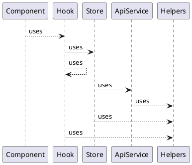
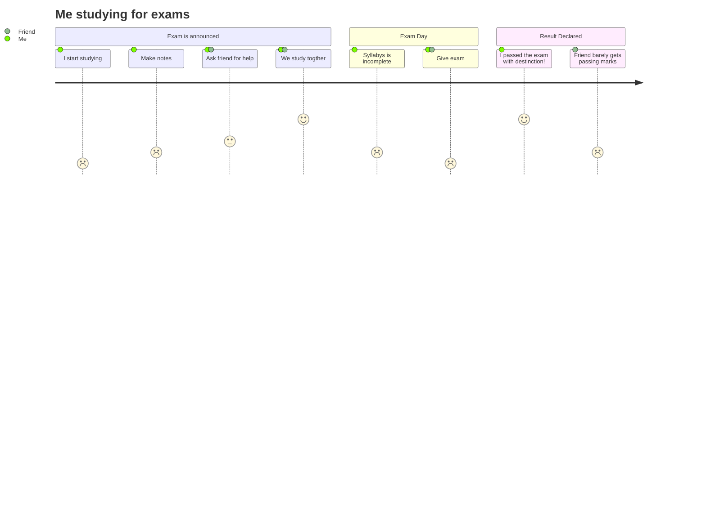
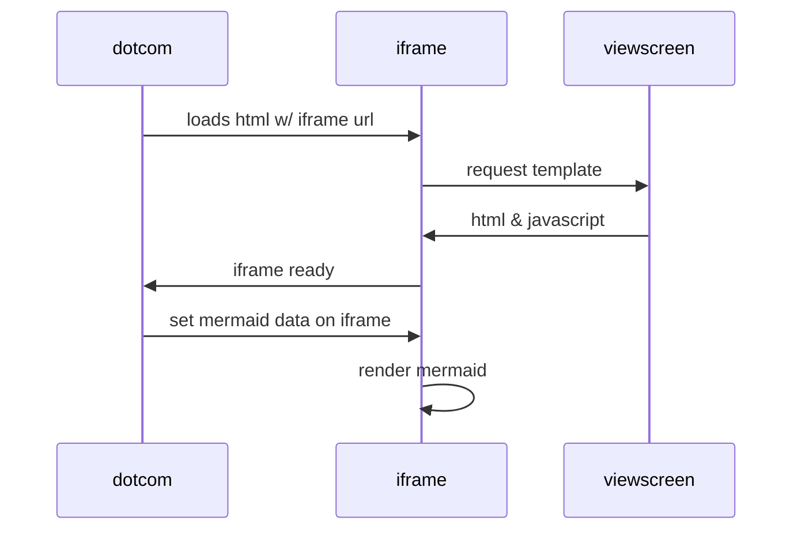

#### Clear Code Structure

#### Slash ở đằng sau BaseURL
NEXT_PUBLIC_MAIN_ENDPOINT=https://5bf0b7fb0756d20013119887.mockapi.io/api/dealers/search/

Quy ước URL KHONG có slash ở đằng sau thường thể hiện đây là 1 resource duy nhất 
Quy ước URL có slash ở đằng sau thể hiện 1 directory hoặc 1 resouce collection
Đây là lí do tại sao baseURL cần có slash ở đằng sau.
ví dụ:
- "http://example.com/mydirectory/example.html"  là 1 resource duy nhất 
- "http://example.com/products/" là một resource collection ( vì theo sau có thể là id, hoặc path khác). chẳng hạn "http://example.com/products/100" hoặc "http://example.com/products/blabla"

